I am a Postdoctoral Researcher in the lab of [Prof. Anthony Wachs](https://personal.math.ubc.ca/~wachs/). I recently obtained my PhD degree from the University of British Columbia. My interdisciplinary research interests pertain to the field of computational fluid dynamics (CFD) and machine learning. My eight-year research experience spans a broad range including mathematical modelling of challenging fluid mechanics problems, algorithm development/optimization of highly scalable numerical solvers enabling high-performance computing of large-scale simulations on supercomputer using FORTRAN and C/C++, data visualization and qualitative/quantitative analysis of simulation results using Python and MATLAB, and forecasting/predictive modelling based on the physics-guided data-driven approaches and physics-informed neural networks using Scikit-learn/Scipy library and TensorFlow in Python to enhance the numerical simulations.

IB-LBM on the adaptive octree grid
======
In this work, I developed a robust numerical solver to simulate flows with fixed and moving rigid particles in both 2D and 3D scenarios. I adopted an explicit feedback Immersed Boundary Method (IBM) to capture the motion of spherical particles, and a multi-relaxation time Lattice Boltzmann Method (LBM) to construct the flow field. To conduct the simulations in a more
efficient manner, I extended this coupled IB-LBM from the fixed uniform grids to the adaptive quadtree (2D) and octree grids (3D). Finally, I implemented the algorithm in the open-source software [Basilisk](http://basilisk.fr/) which enables the adaptive mesh refinement (AMR) on tree-type grids and effective dynamic load balancing for MPI parallel executions. Below is a test case featuring an in-line oscillating cylinder in a fluid at rest, in which the time evolution of vorticity field is shown together with the corresponding quadtree grid:

| In-line oscillating cylinder in a fluid at rest |
|:-------------------------------:|
|  |

This AMR-IB-LBM has been validated to be accurate, efficient and robust in various 2D and 3D flow configurations with stationary or moving solid particles. Here are two more exmaples:

* 2D flow past two cylinders in side-by-side configuration:

| Flow past two cylinders |
|:-------------------------------:|
|  |

Vorticity field | Quadtree grid
:-------------------------------:|:-------------------------------:
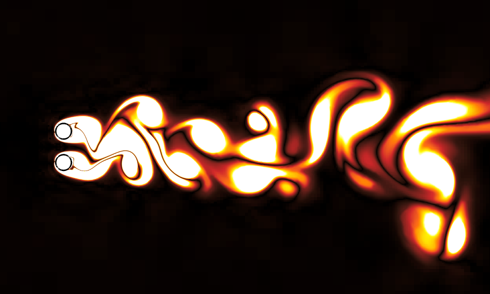 | 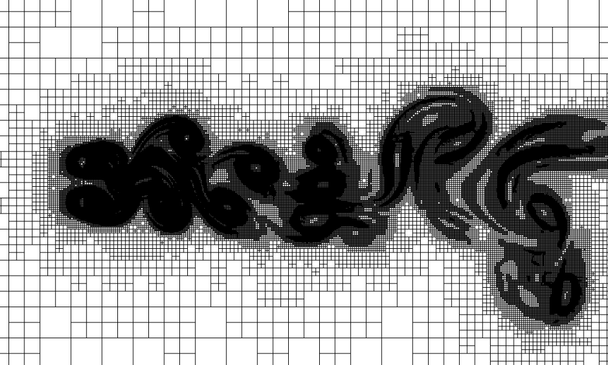

* 3D settling sphere in an otherwise quiescent fluid:

$Ga=49.14,\rho_{s}/\rho_{f}=2.56$ | $Ga=178.46,\rho_{s}/\rho_{f}=1.5$ | $Ga=206.27,\rho_{s}/\rho_{f}=7.71$ | $Ga=255.35,\rho_{s}/\rho_{f}=2.56$
:-------------------------------:|:-------------------------------:|:-------------------------------:|:-------------------------------:
 |  |  | 
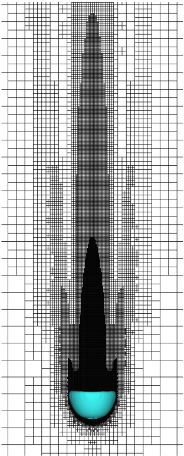 | 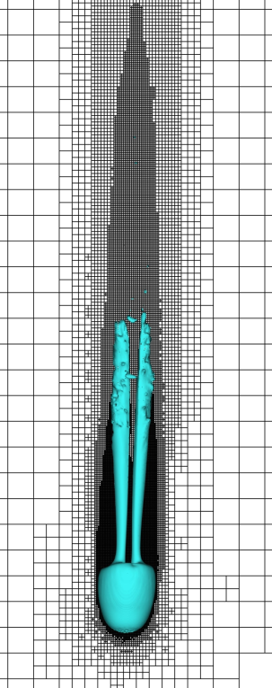 | 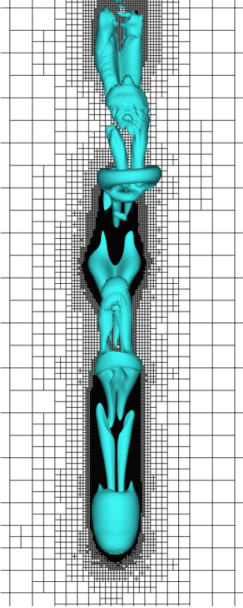 | 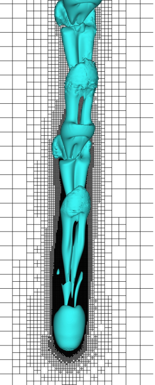

 

Flow past polydisperse spheres
======

In this work, I used the octree grid adaptive IB-LBM presented above to generate a dataset related to the flow past a random
array of stationary bidisperse and polydisperse spheres. The particle-resolved direct numerical simulations (PR-DNS) were conducted in MPI parallel mode on up to 3000 CPU cores using the supercomputers provided by the [Digital Research Alliance of Canada](https://alliancecan.ca/en). I subsequently analyzed the dataset and provide new knowledge on the distributions of force and torque exerted on individual spheres in the array. Finally, I extended an probability-based model originally developed in the context of monodisperse spheres to the more challenging case of bidisperse spheres. The configurations of bidisperse and polydisperse spheres are exhibited below:

Bidisperse spheres | Polydisperse spheres
:-------------------------------:|:-------------------------------:
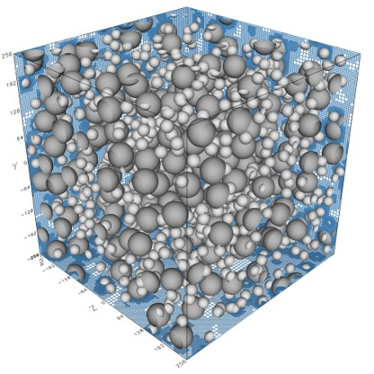 | 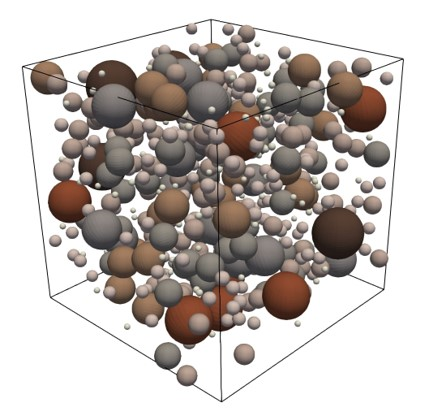

The normalized fluid-particle interaction forces on individual particles in bidisperse arrays obtained from PR-DNS have the following spatial distributions:

$Re=1$ | $Re=100$
:-------------------------------:|:-------------------------------:
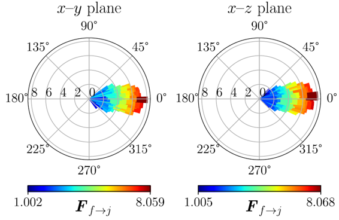 | 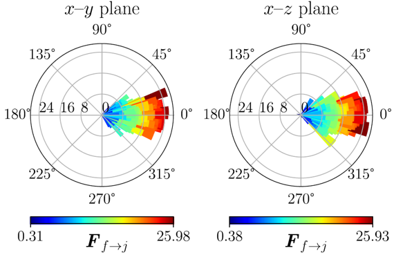

The force and torque exerted on each class of spheres in polydisperse arrays consistently follow the Gaussian distribution:

| $F_x$ of the flow past polydisperse spheres |
|:-------------------------------:|
| 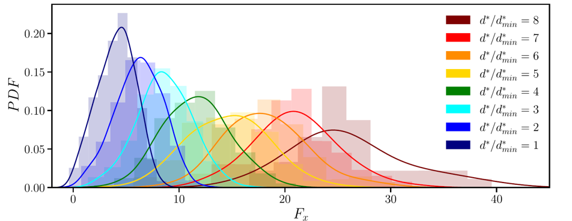 |

The conditioned probability distribution maps of the flow past bidisperse spheres are comparable to those in the cases of monodisperse spheres as shown by [Dr. Seyed-Ahmadi and Dr. Wachs](https://www.cambridge.org/core/journals/journal-of-fluid-mechanics/article/abs/microstructureinformed-probabilitydriven-pointparticle-model-for-hydrodynamic-forces-and-torques-in-particleladen-flows/07DEC607BE08A98D26DAF291ECFB518D):

| Probability distributions filtered by $\Delta F_x>0$ |
|:-------------------------------:|
| 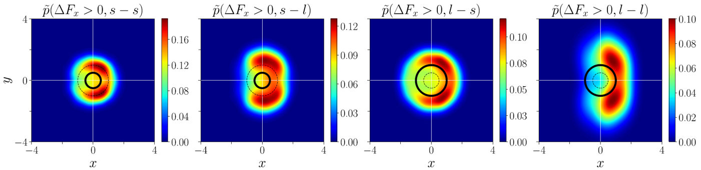 |

 

Physics-informed neural network (PINN)
======

In this work, I established a PINN model in a special form of common NN block for all influential neighbors, and account for the effect of both the local flows and microstructure through an element-wise multiplication operation. The individual contribution of each neighbor is evaluated separately but processed by the same NN block according to the pairwise interaction assumption and unified function representation, and linearly superposed to acquire the total force/torque exerted on a target sphere. Apart from the great accuracy and generalization performance for predicting force/torque fluctuations in bidisperse suspensions, we can also see the potential of extending such a compact yet robust PINN model to more complicated polydisperse suspensions and EL simulations. The architecture of this PINN model is illustrated below:

| PINN |
|:-------------------------------:|
| 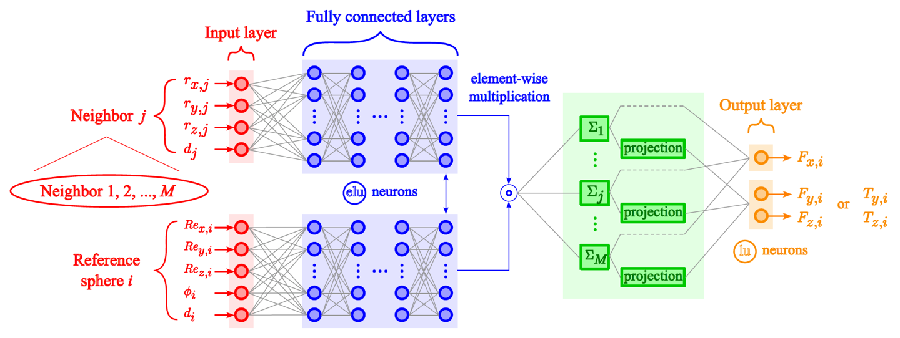 |

The predictions given by this PINN model are highly close to the ground truth (PR-DNS results):

| Correlation plot of the PINN predictions and PR-DNS data |
|:-------------------------------:|
| 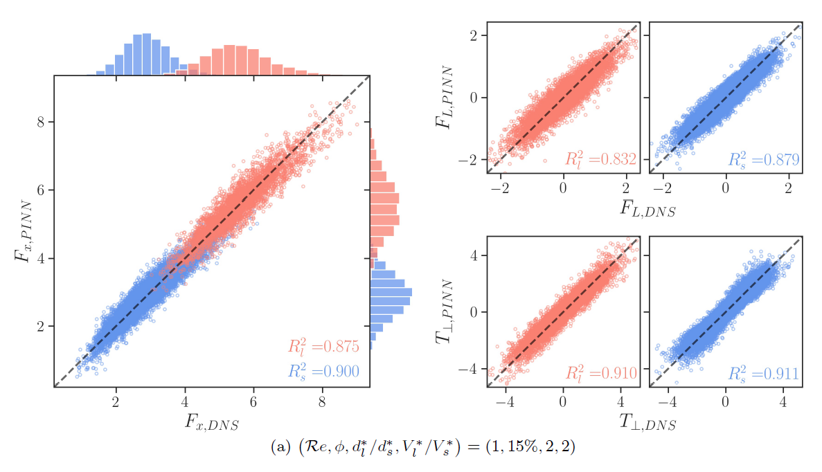 |

 

Wettability on the micro-structured surface
======

In this work, I employed a multiphase color-gradient lattice Boltzmann model to simulate the droplet dynamic behaviors on the rough surfaces with different configurations of micro-pillar arrays. As the primary results, I numerically reproduced several non-circular contact line shapes that were previously revealed by experiments of [Raj, et al.](https://www.nature.com/articles/ncomms5975):

| Shapes of 3D droplets and their contact areas |
|:-------------------------------:|
| 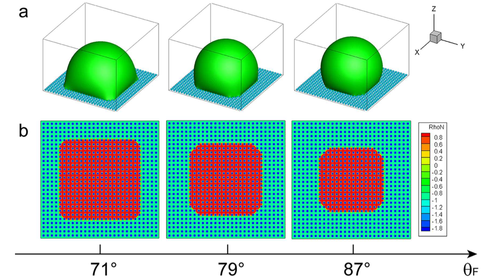 |

 

Complex vortical flows past the moving/deforming bodies
======

I anticipated this work initiated by Dr. Wang. The objective of this study is to develop a vortex method (VM) that is suited for simulating the fluid-solid interactions of the moving/deforming body flows. The method has been used to simulate some distinct flows of different boundaries and features, and one of these interesting simulations is the flow process of a self-propelled anguilliform swimmer:

| Vorticity contours of the self-propelled swimmer |
|:-------------------------------:|
| 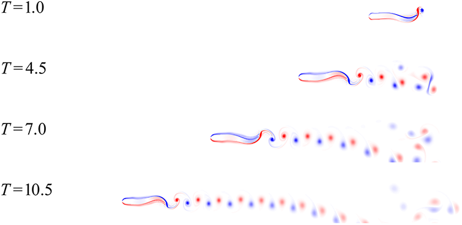 |