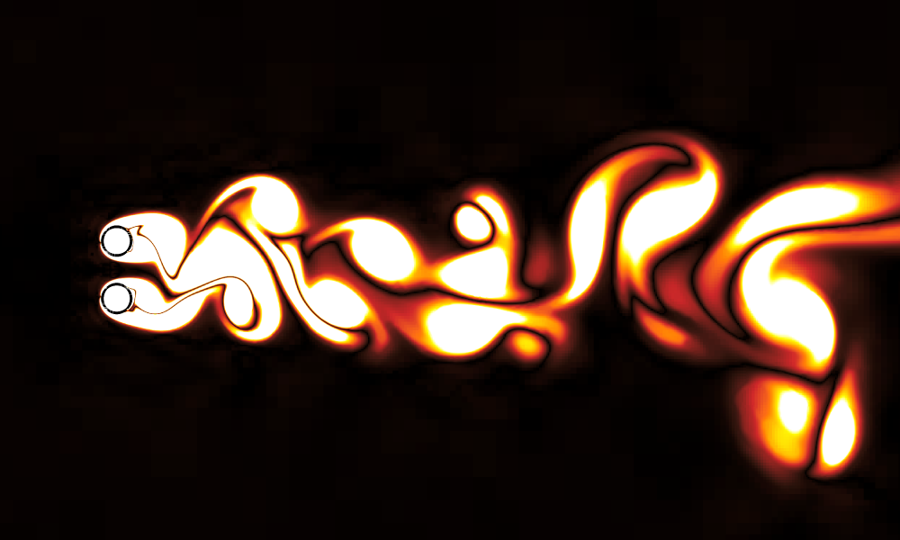
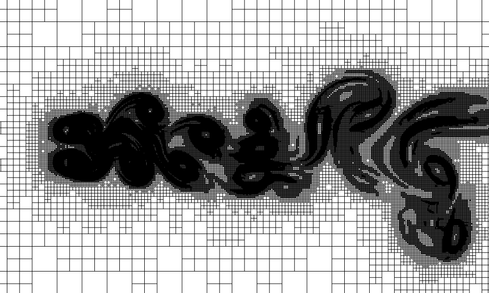

I am a research assistant in the lab of [Prof. Anthony Wachs](https://personal.math.ubc.ca/~wachs/). I recently obtained my PhD degree from the University of British Columbia. My interdisciplinary research interests pertain to the field of computational fluid dynamics (CFD) and machine learning. My eight-year research experience spans a broad range including mathematical modelling of challenging fluid mechanics problems, algorithm development/optimization of highly scalable numerical solvers enabling high-performance computing of large-scale simulations on supercomputer using FORTRAN and C/C++, data visualization and qualitative/quantitative analysis of simulation results using Python and MATLAB, and forecasting/predictive modelling based on the physics-guided data-driven approaches and physics-informed neural networks using Scikit-learn/Scipy library and TensorFlow in Python to enhance the numerical simulations.

LBM on the adaptive octree grid
======
In this work, I developed a robust numerical solver to simulate flows with fixed and moving rigid particles in both 2D and 3D scenarios. I adopted an explicit feedback Immersed Boundary Method (IBM) to capture the motion of spherical particles, and a multi-relaxation time Lattice Boltzmann Method (LBM) to construct the flow field. To conduct the simulations in a more
efficient manner, I extended this coupled IB-LBM from the fixed uniform grids to the adaptive quadtree (2D) and octree grids (3D). Finally, I implemented the algorithm in the open-source software [Basilisk](http://basilisk.fr/) which enables the adaptive mesh refinement (AMR) on tree-type grids and effective dynamic load balancing for MPI parallel executions. Below is a test case featuring an in-line oscillating cylinder in a fluid at rest, in which the time evolution of vorticity field is shown together with the corresponding quadtree grid.

| In-line oscillating cylinder in a fluid at rest |
|:-------------------------------:|
|  |

This AMR-IB-LBM has been validated to be accurate, efficient and robust in various 2D and 3D flow configurations with stationary or moving solid particles. Here are two more exmaples:
1. Flow past two cylinders in side-by-side configuration:

| Flow past two cylinders |
|:-------------------------------:|
|  |

Vorticity field | Quadtree grid
:-------------------------------:|:-------------------------------:
 | 
